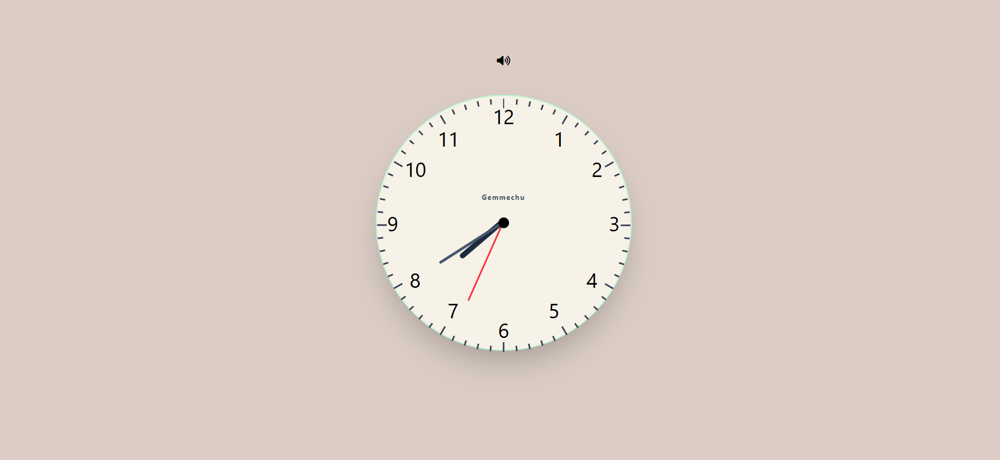

# Analog Wall Clock with Tick Sound

An interactive Analog Wall Clock built using HTML, Tailwind CSS, and JavaScript. The clock displays the current time in real-time with smoothly moving clock hands and realistic tick marks around the clock face. It also includes a tick sound effect and a sound control button that allows users to mute or unmute the ticking sound.

## Preview

> Upload a screenshot of your project inside an `images` folder and replace the file name if necessary.

```md

```

### Project Structure for Preview Image

```text
project/
│
├── index.html
├── script.js
├── tick.mp3
└── images/
    └── analog-clock-preview.png
```

---

## Features

- Real-time Analog Wall Clock.
- Automatically updates every second.
- Smooth movement of:
  - Hour hand
  - Minute hand
  - Second hand

- 60 dynamically generated clock tick marks.
- Larger tick marks for hour positions.
- Realistic tick sound effect.
- Sound ON/OFF button.
- Responsive and modern UI.
- Built with Tailwind CSS.
- Uses JavaScript DOM Manipulation.
- Fully customizable design.

---

## Technologies Used

- HTML5
- Tailwind CSS
- JavaScript (ES6)
- DOM Manipulation
- CSS Transform & Rotation
- Font Awesome Icons
- HTML Audio API

---

## Project Structure

```text
project/
│
├── index.html        --> HTML structure of the clock
├── script.js         --> JavaScript functionality
├── tick.mp3          --> Clock tick sound effect
└── analog.png
```

---

## How the Analog Clock Works

An analog clock is a circular clock consisting of three hands:

1. Hour Hand
2. Minute Hand
3. Second Hand

The clock uses the current system time obtained from JavaScript's Date object.

```javascript
let date = new Date();
```

JavaScript provides:

```javascript
date.getHours();
date.getMinutes();
date.getSeconds();
```

which are used to rotate the clock hands.

---

## Clock Rotation System

A circle contains:

```text
360°
```

### Second Hand

The clock contains:

```text
60 seconds
```

Therefore:

```text
360° ÷ 60 = 6°
```

Every second rotates the second hand by:

```text
6°
```

Formula:

```javascript
let secondDeg = s * 6;
```

Examples:

```text
1 second = 6°
10 seconds = 60°
15 seconds = 90°
30 seconds = 180°
```

---

### Minute Hand

The clock contains:

```text
60 minutes
```

Therefore:

```text
360° ÷ 60 = 6°
```

Formula:

```javascript
let minuteDeg = m * 6;
```

To make the minute hand move smoothly every second, we add:

```javascript
+s * 0.1;
```

Final formula:

```javascript
let minuteDeg = m * 6 + s * 0.1;
```

Why?

```text
6° ÷ 60 seconds = 0.1°
```

Every second moves the minute hand by:

```text
0.1°
```

This creates smooth movement instead of jumping every minute.

---

### Hour Hand

The clock contains:

```text
12 hours
```

Therefore:

```text
360° ÷ 12 = 30°
```

Formula:

```javascript
let hourDeg = (h % 12) * 30;
```

To create smooth movement while the minutes pass, we add:

```javascript
+m * 0.5;
```

Final formula:

```javascript
let hourDeg = (h % 12) * 30 + m * 0.5;
```

Why?

```text
30° ÷ 60 minutes = 0.5°
```

Every minute moves the hour hand by:

```text
0.5°
```

This makes the hour hand behave like a real wall clock.

---

## Tick Marks

Instead of manually creating all 60 tick marks, JavaScript dynamically generates them.

```javascript
for (let min = 0; min < 60; min++) {
    ...
}
```

This loop creates:

```text
60 clock tick marks.
```

Every 5th tick mark is larger to represent the hour positions:

```text
12
1
2
3
4
5
6
7
8
9
10
11
```

Example:

```javascript
tick.style.height = min % 5 === 0 ? "14px" : "8px";
```

If the minute value is divisible by 5, a larger tick mark is created.

---

## DOM Manipulation Used

The project makes extensive use of DOM Manipulation.

Examples:

```javascript
document.getElementById();
```

Used to access:

- Clock
- Hour hand
- Minute hand
- Second hand
- Sound button

Creating elements dynamically:

```javascript
document.createElement("div");
```

Adding elements:

```javascript
appendChild();
```

Updating styles:

```javascript
style.transform;
style.height;
style.transformOrigin;
```

---

## Sound Effect

The clock includes a realistic tick sound effect.

The sound file:

```text
tick.mp3
```

is played every second.

The project also provides:

- Volume ON button.
- Volume OFF button.

Users can mute or unmute the ticking sound at any time.

---

## Sound Control Button

The sound button uses Font Awesome icons.

### Sound ON

```html
<i class="fa-solid fa-volume-high"></i>
```

### Sound OFF

```html
<i class="fa-solid fa-volume-xmark"></i>
```

The icon changes dynamically when clicked.

---

## Tailwind CSS Classes Used

Some of the commonly used Tailwind CSS classes include:

```text
flex
flex-col
justify-center
items-center
rounded-full
shadow-2xl
absolute
relative
text-3xl
origin-bottom
left-1/2
top-1/2
-translate-x-1/2
-translate-y-1/2
bg-gray-700
w-96
h-96
```

These classes are responsible for:

- Positioning.
- Sizing.
- Centering.
- Styling.
- Shadows.
- Colors.
- Rotation origins.
- Responsive layouts.

---

## Learning Concepts Covered

This project is excellent for practicing:

- HTML
- Tailwind CSS
- JavaScript
- DOM Manipulation
- JavaScript Date Object
- Analog Clock Mathematics
- CSS Transform
- Rotation and Degrees
- HTML Audio API
- Event Listeners
- Dynamic Element Creation
- Real-time Applications
- Responsive Design
- UI Design

---

## Future Improvements

Possible enhancements include:

- Digital Clock Display
- Timezone Support
- Date Display

---

## Getting Started

Clone the repository:

```bash
git clone https://github.com/GemmechuBekele/analog_clock.git
```

Navigate to the project folder:

```bash
cd Analog-Wall-Clock
```

Open:

```text
index.html
```

or use Live Server in Visual Studio Code.

---

## Author

**Amanuel Bekele or Gemmechu Bekele**

Built with HTML, Tailwind CSS, and JavaScript for learning DOM Manipulation, JavaScript Date APIs, CSS Transformations, and Analog Clock Mathematics.
